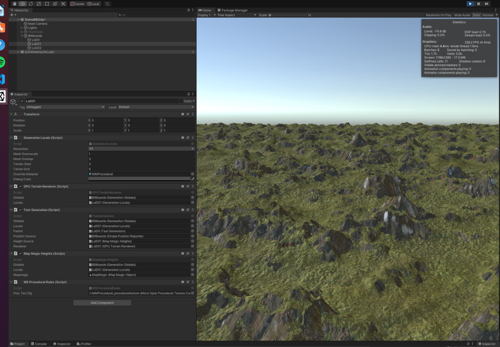
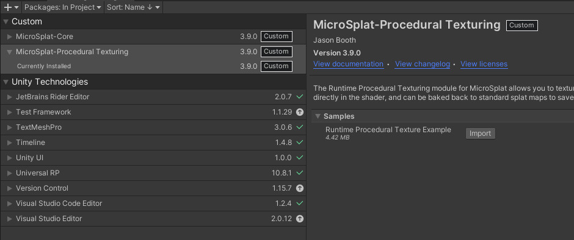
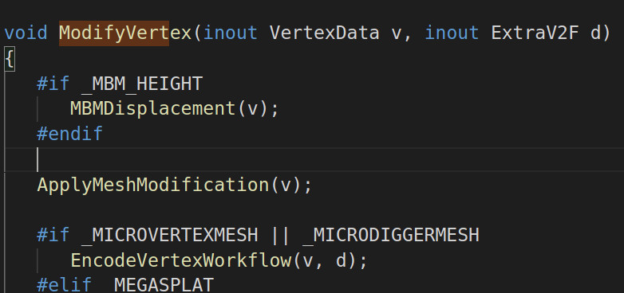
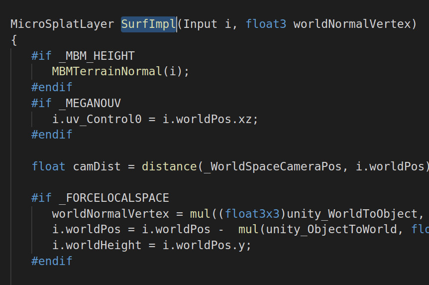

# MBM Renderer Plugin for Microsplat

## Purpose

For the sake of efficiency, the renderer sends the same flat mesh to the GPU. This means displacing the heights of each vertex so that we get a terrain is left to the shader. Microsplat (MS) is a powerful terrain shader with many modules that are useful to us (SRP specific, Procedural, Anti-tiling, etc), but we need it at a bare minimum to read our height buffer and displace each vertex. That's what this plugin does.

## Requirements

 - MapMagic2 Core (only for this demo as a height source)
 - MBM (and Samples! for the demo)
 - Microsplat Core
 - MS Procedural Texturing Module (and Samples!)
 - MS URP Module 202x (for URP)
 - MS HDRP Module 202x (for HDRP) [*!not tested!*]

First, add all of the packages you need. Then, for the purpose of this guide, you should also import the samples for MS Procedural from `Package Manager -> In Project -> Custom -> Microsplat Procedural Texturing -> Samples`

## Pre-Setup

MS is an edit/compile-time shader generator. It pieces things together from templates and is modular, but not completely extensible without modifying MS itself. To add the plugin, you will have to Edit MS and make sure that after a MS upgrade that the modifications are still in place.

In `MicroSplatPlugin/Editor/Fragments` you'll find the body of the plugin. In that folder, `microsplat_func_mbm.txt` holds the functions. There you'll find the current instructions for providing hooks to the plugin from the main module. This is unfortunately required.

To do so, navigate to the MS Core library in your `/Packages` folder (MS also uses UPM installation). Currently `MicroSplat-Core/Scripts/Editor/Fragments`

At the minimum we need hooks into:

 - `microsplat_terrain_core_vertex.txt`
 - `microsplat_terrain_body.txt`

## Setup

For the purpose of this guide, we assume that you have a scene setup that's already generating heights and working with the `Billboard` shader. If you don't, then I highly suggest you use the `DemoBBOnly` scene in the MapMagic samples. If you use DemoURP instead then you need another matching Microplat shader setup in MapMagic and it's twice as complicated.

### Walkthrough:

 - Open the MS Procedural Demo Scene
    
    (If nothing renders, check that the "Render Loop" in the MS Material is set to your pipeline)

 - In Procedural Texturing, uncheck (not yet supported)
    - Cavity Map
    - Erosion Map
 - Change the Height and Slope Settings in the layers of the "Procedural Texture" section until your terrain is once again textured.
    
    (Just checking on the existing Height and Slope selectors should be enough)
 - **Pin this material to an inspector as we're going to copy all it's settings.**
 - Create `Shaders/Microsplat Shader`, name it like `MBM_MS`
 - Make a new Material with a name like `MBMProceduralMS`
 - Select `Microsplat/Microsplat` as the Shader and change the Shader Name to something like `MicroSplat/MBM` in the MS interface.
 - Copy all of the settings from the example material into the new one, or particular importance are the procedural settings and textures from the `Splats` section.
 - In the `Mountains Beyond Mountains` section, select `Heights`
 - Open the MBM sample scene you want to work with.
 - Add a `MSProceduralRules` component LoD-set GameObject.
   (I.E.) Under `Billboards` each of Lod1, Lod2, Lod3 need this component
 - In each `MSProceduralRules` component, select the `ProcTexCfG` that matches your material name, we used  `MBMProceduralMS` above. 
 - Hit Play and checkout the textured terrain.

 ### Hints

 You can also use the same MS Procedural configuration from the MS Procedural scene instead of the one associated with your new material. As long as the number of layers are the same and in the same order the shader doesn't care. This can help to develop a procedural texturing stragegy in a fixed scene like the MS tutorial, and then have it propogate to your live produrally generated terrain.

 In this plugin, procedural texturing setting copied to the shaders buffer **once** at play time. If you change the settings, you need to restart the scene. If you develop in the MS Demo scene, the changes to the procedural texturing rules should update in real-time.

