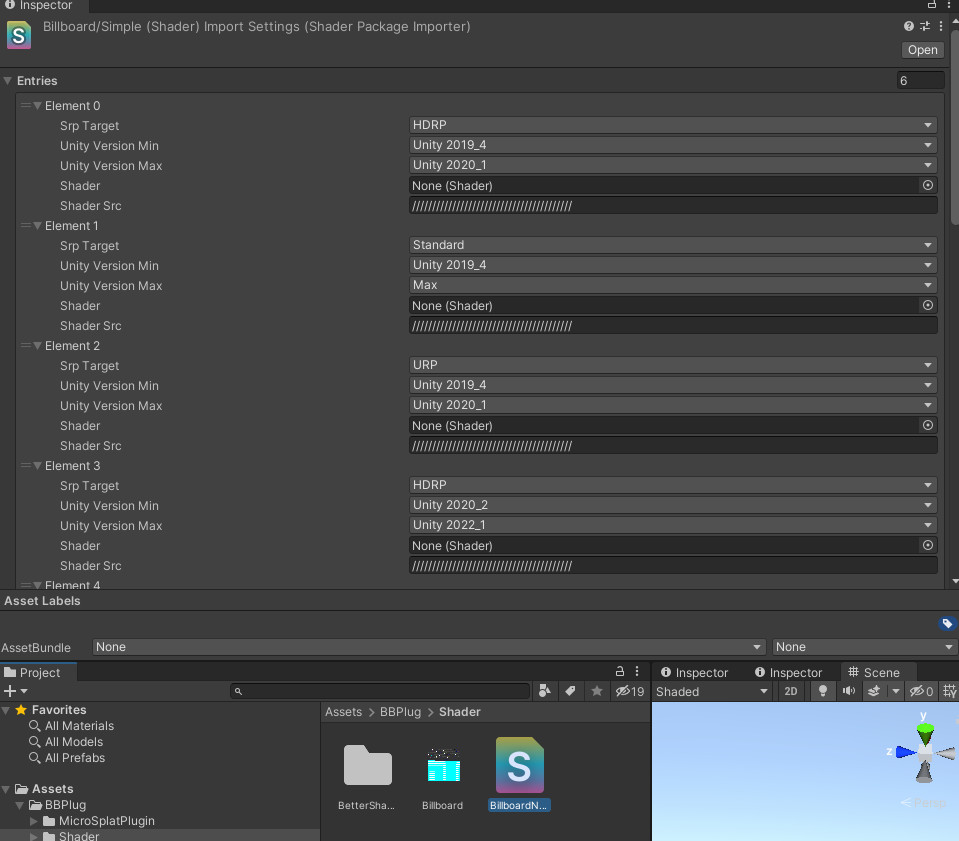
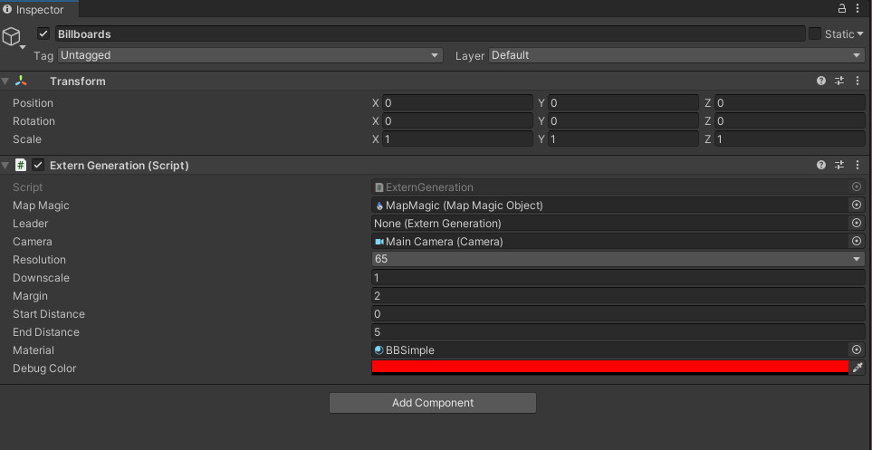
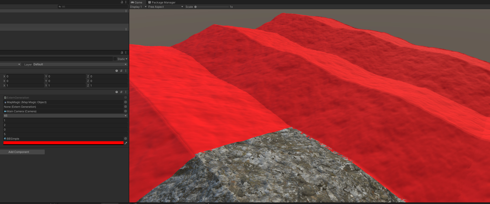
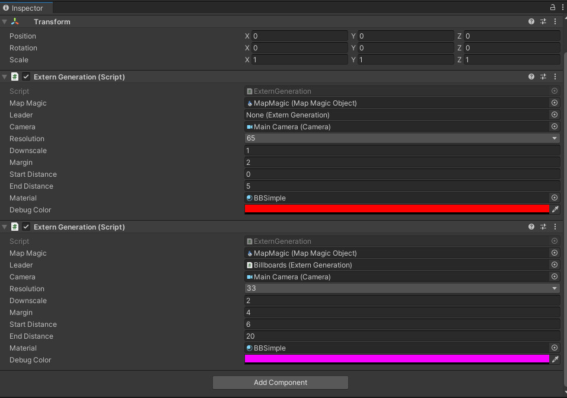
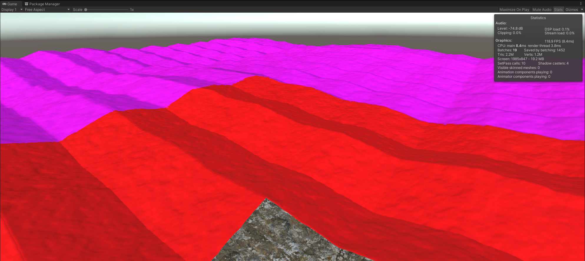
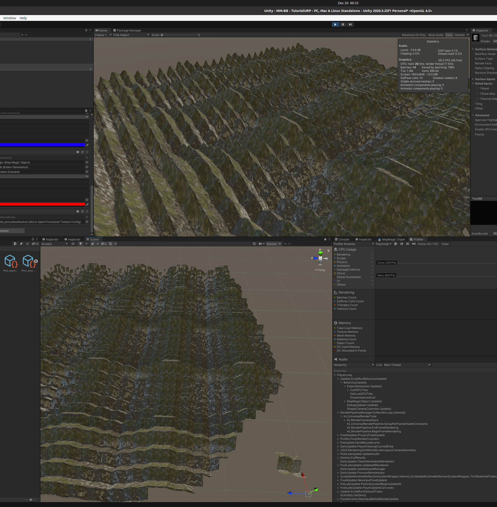

## Introduction:

This tool is intended to allow you to draw large amounts of distant virtual terrain in Unity. By virtual we mean only to be seen and not interacted with on the CPU side, so no colliders, no game objects etc. Anything could in theory be used to provide the heightmaps for the terrain, but MapMagic2 is what's required by the included `ExternGeneration` component and used by `Generation.cs` as a data source. This does not currently play well with "pinned tiles". It can, but there are competing priorities so open a ticket if you're interested.

## Quickstart:

Clone the repo into your project's `/Assets` Folder.

In `./Shaders` you'll find a shader that takes procedural heights. If you have the "Better Shaders" asset the source is also here and you can do quite a bit. For now, make a material from the included `Billboard/Simple` shader.

You don't need to mess with any of the material properties, it all gets read into Material Properties blocks anyway when it's used by the component.

You can start with any scene that has MapMagic and just add a GameObject and call it something like Billboards. We'll put all of our components here.

Add the `Extern Generation` component. Plug in your MapMagic Object, Main Camera and the material that you made from the shader. Since this is the first resolution octave of billboards, you can leave the `leader` blank. Pick a resolution lower than your drafts. 65 is reasonable. Pick a nice color for the terrain Albedo and press play.

The component will request heights from MapMagic that are outside of it's range but closer than End Distance. When you move, the billboards generate dynamically as if they were an additional LoD within MapMagic. Even a resolution of 65 can get expensive if you have hundreds, so let's add another octave at a lower resolution. 

Clone your first component. Reference the first component as leader so we can simplify the signal chain from MapMagic. MapMagic doesn't do 16x16 resolution, but we have the option to downsample to save on drawn geometry. In the distance it still can look good. If you downsample, you need to use a power of two, and the overlap must be a either == downsample or 2x downsample. Here we add another range of 20.

How much can you draw with a good graphics card?

Here's a range of 50.

The solid colors are ok, but you want billboards to look like the normal terrain. There's also a MicroSplat plugin included with this package. This allows you to set procedural rules in Microsplat and have them rendered on your billboards. The performance isn't much worse using textures and the current bottlenecks are the same.

## MicroSplat Plugin Guide

//TODO
